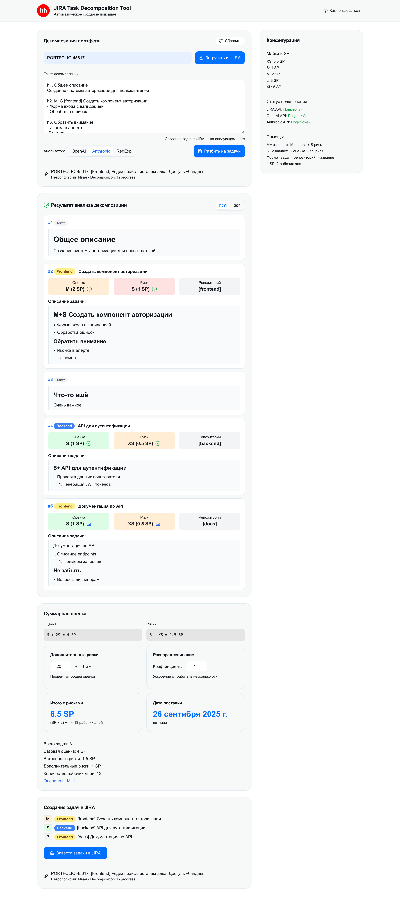

# JIRA Task Decomposition Tool

Автоматический инструмент для декомпозиции задач JIRA.
Приложение анализирует текст декомпозиции в задаче JIRA, разбивает его на подзадачи,
рассчитывает оценки и автоматически создает новые связанные задачи в JIRA.



## 🚀 Возможности

- **Автоматический парсинг**: Использует OpenAI/LLM для интеллектуального анализа текста декомпозиции
- **Умная оценка**: Распознает оценки в T-shirt размерах (XS, S, M) и конвертирует в Story Points
- **Управление рисками**: Автоматическое выявление и расчет рисков из текста задач
- **Интеграция с JIRA**: Загрузка задач и автоматическое создание подзадач
- **Расчет сроков**: Автоматическое вычисление ориентировочной даты поставки
- **Docker-ready**: Полная контейнеризация для простого развертывания

## 📋 Technical Stack

- **Frontend**: React 18, TypeScript, CSS Modules
- **Backend**: Express.js, Node.js 20+
- **AI/LLM**: OpenAI-совместимый API
- **Контейнеризация**: Docker, docker compose
- **Пакетный менеджер**: npm (с планами на Yarn 4 + PNP)

## 📦 Предварительные требования

- **Docker** и **docker compose**
- **Node.js** v20 или v21 (для разработки)
- **npm** 9+ (для разработки)
- Доступ к **JIRA API**
- **OpenAI API ключ** (или совместимый LLM API)
- **Anthropic API ключ** (или совместимый LLM API)

## 🛠 Быстрый запуск с Docker

### 1. Клонирование и настройка

```bash
git clone <repository-url>
cd replit-ticket-plasma-gun

# Создание файла окружения из примера
cp .env.example .env
```

### 2. Настройка переменных окружения

Отредактируйте файл `.env`:

```env
# JIRA Configuration
JIRA_HOST=https://your-jira-instance.com
JIRA_USER=your_username
JIRA_TOKEN=your_jira_api_token

# OpenAI Configuration (не обязательно)
OPENAI_HOST=https://llmgtw.hhdev.ru/proxy/openai
OPENAI_API_KEY=your_openai_api_key
OPENAI_MODEL=gpt-4

# Anthropic Configuration (не обязательно)
ANTHROPIC_HOST=https://llmgtw.hhdev.ru/proxy/anthropic
ANTHROPIC_API_KEY=your_anthropic_api_key
ANTHROPIC_MODEL=claude-sonnet-4-20250514

# Application Configuration
NODE_ENV=production
PORT=3000
```

### 3. Запуск приложения

```bash
# Запуск всех сервисов
docker compose build --no-cache
docker compose up -d

# Просмотр логов
docker compose logs -f app

# Остановка сервисов
docker compose down
```

Приложение будет доступно по адресу: `http://localhost:3000`


## 💻 Разработка

### Локальная установка

```bash
# Установка зависимостей
npm install

# Запуск в режиме разработки
npm run dev
# Произвольный порт
PORT=5009 npm run dev
```

### Структура проекта

```
jira-task-decomposition/
├── client/src/           # React фронтенд
│   ├── components/       # React компоненты
│   ├── pages/           # Страницы приложения
│   ├── lib/             # Утилиты и API клиент
│   └── hooks/           # React хуки
├── server/              # Express backend
│   ├── services/        # Бизнес-логика
│   ├── routes.ts        # API маршруты
│   └── index.ts         # Точка входа сервера
├── shared/              # Общие типы и схемы
├── config/              # Конфигурационные файлы
├── docker-compose.yml   # Docker конфигурация
└── Dockerfile          # Образ приложения
```

### Доступные команды

```bash
# Разработка
npm run dev              # Запуск в режиме разработки
npm run build           # Сборка для продакшена  
npm run start           # Запуск продакшен версии

# Код-стайл
npm run ts-check      # Проверка типов TypeScript
```

## 🔧 Конфигурация

### Настройка оценок

Файл `config/estimation-mapping.json` содержит маппинг T-shirt размеров в Story Points:

```json
{
  "XS": 0.5,
  "S": 1,
  "M": 2
}
```

Этот файл подключается как volume в Docker, поэтому его можно изменить без пересборки образа.

### Получение JIRA API токена

1. Войдите в свою JIRA
2. Перейдите в **Account settings** → **Security** → **API tokens**
3. Создайте новый токен
4. Используйте его как `JIRA_TOKEN` в `.env`

### Получение OpenAI API ключа

1. Зарегистрируйтесь на [platform.openai.com](https://platform.openai.com)
2. Создайте API ключ в разделе **API keys**
3. Используйте его как `OPENAI_API_KEY` в `.env`

### Использование альтернативных LLM

Приложение поддерживает любые OpenAI-совместимые API:

```env
# Например, для локального LLM
OPENAI_HOST=http://localhost:1234/v1
OPENAI_API_KEY=your_openai_api_key
```

## 📖 Использование

### 1. Подготовка задачи в JIRA

Создайте или откройте задачу в JIRA и заполните поле **"Декомпозиция"** (customfield_36836):

```
Декомпозиция фронта, бэк в PORTFOLIO-12345.

h2. Общее описание
Основные требования к функциональности...

h2. M [frontend] Модальное окно регионов
- Высота модала фиксирована
- Поле поиска по регионам  
- Блок рекомендуемых регионов

*S+ [backend] API для регионов*
- Новый эндпоинт GET /api/regions
- Поддержка поиска и фильтрации
- Кэширование результатов

h2. XS [frontend] Валидация форм
- Проверка обязательных полей
- Показ ошибок пользователю
```

### 2. Использование приложения

1. **Введите ключ задачи** или ссылку на JIRA (например: `PORTFOLIO-12345`)
2. **Нажмите "Загрузить"** - приложение получит данные из JIRA
3. **Дождитесь автоматического парсинга** - LLM разберет текст декомпозиции
4. **Проверьте результат** - убедитесь, что задачи определены корректно
5. **Настройте дополнительные риски** - по умолчанию 20% от общей оценки
6. **Нажмите "Завести задачи"** - создание новых задач в JIRA

### 3. Формат названий задач

Приложение распознает следующие форматы:

- `M [repo] Название задачи` - оценка M, репозиторий repo
- `S+ [api] Задача с риском` - оценка S, риск XS
- `*XS [frontend] Задача*` - разметка JIRA с оценкой XS

## 🔍 API Документация

### Получение задачи из JIRA

```http
POST /api/jira/task
Content-Type: application/json

{
  "input": "PORTFOLIO-12345"
}
```

### Парсинг декомпозиции

```http
POST /api/decomposition/parse
Content-Type: application/json

{
  "decompositionText": "h2. M [repo] Task...",
  "jiraKey": "PORTFOLIO-12345"
}
```

### Создание задач

```http
POST /api/jira/create-tasks
Content-Type: application/json

{
  "sessionId": "uuid",
  "additionalRiskPercent": 20
}
```

## 🚨 Устранение неполадок

### Проблемы с Docker

```bash
# Очистка Docker кэша
docker system prune -a

# Пересборка образов
docker compose build --no-cache

# Просмотр логов конкретного сервиса
docker compose logs -f app
docker compose logs -f db
```

### Проблемы с JIRA API

1. Проверьте права доступа к JIRA API
2. Убедитесь, что токен активен
3. Проверьте настройки CORS, если JIRA в корпоративной сети
4. Для внутренних JIRA может потребоваться VPN подключение

### Проблемы с OpenAI API

1. Проверьте баланс на аккаунте OpenAI
2. Убедитесь, что API ключ имеет необходимые права
3. Проверьте лимиты запросов (rate limits)

## 🔒 Безопасность

- **API ключи**: Никогда не коммитьте `.env` файлы в репозиторий
- **JIRA токены**: Регулярно обновляйте API токены  
- **Сеть**: Используйте HTTPS в продакшене
- **Контейнеры**: Регулярно обновляйте базовые образы

## 📋 Известные ограничения

1. Поддерживается только JIRA Server/Cloud с REST API v2
2. Максимальная длина текста декомпозиции ограничена лимитами LLM
3. Поддерживаются только оценки: XS (0.5 SP), S (1 SP), M (2 SP), L (3 SP), XL (5 SP)
4. Создание задач происходит в проекте 'HH' (настраивается в коде)

## 🤝 Поддержка

Для вопросов и предложений:

1. Создайте issue в репозитории
2. Проверьте существующие issues
3. Приложите логи Docker контейнеров при багрепортах
